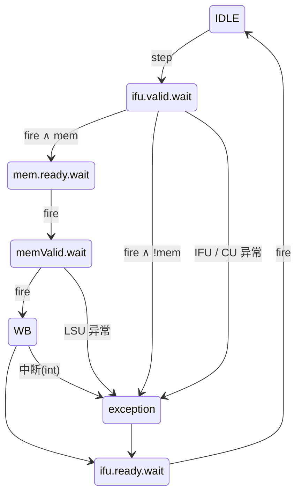
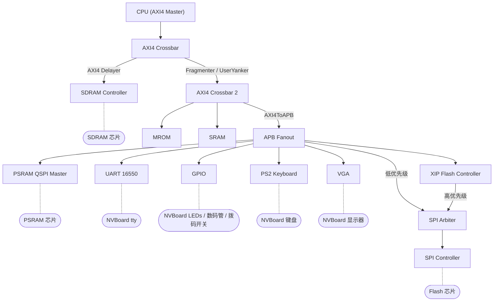
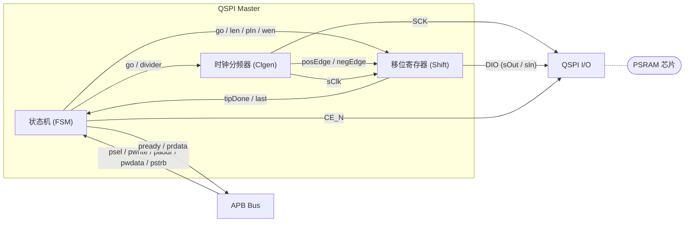
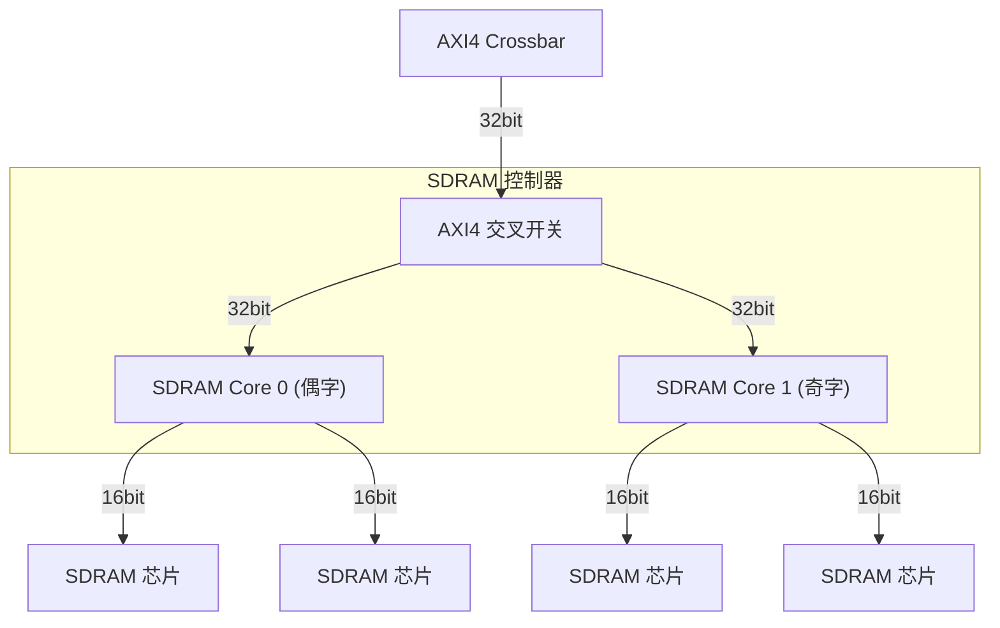
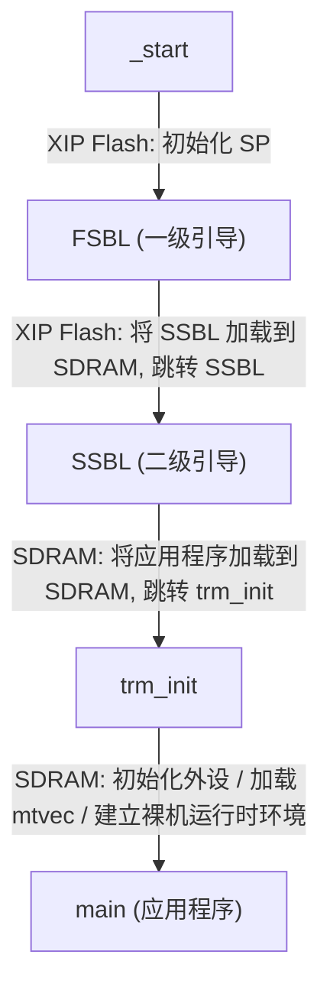
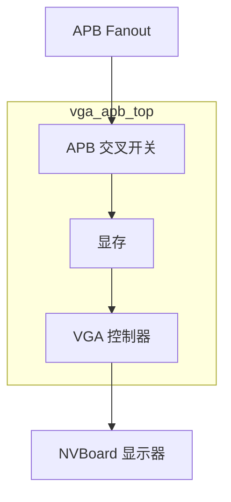
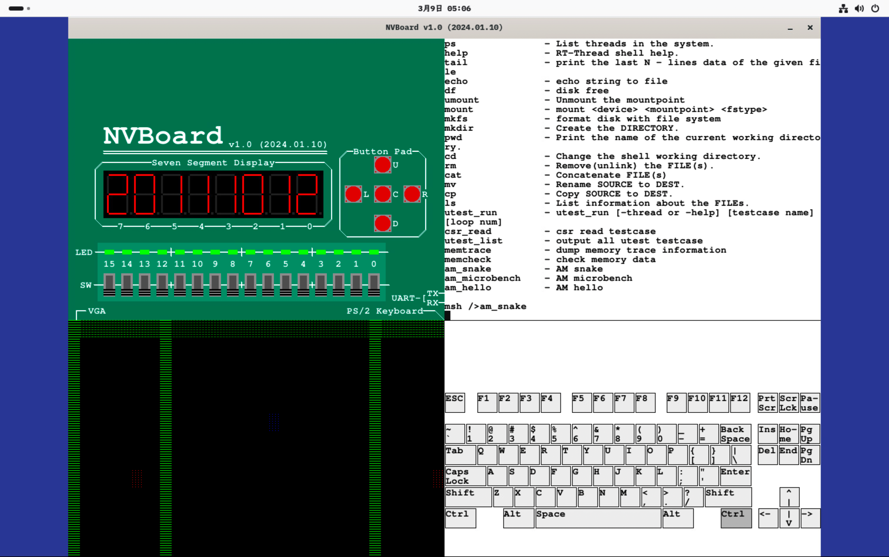
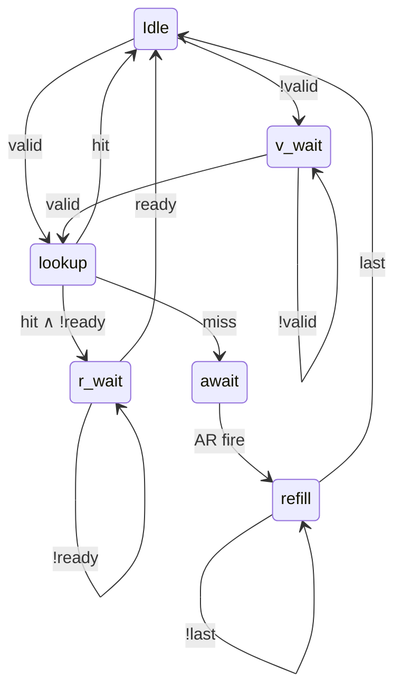
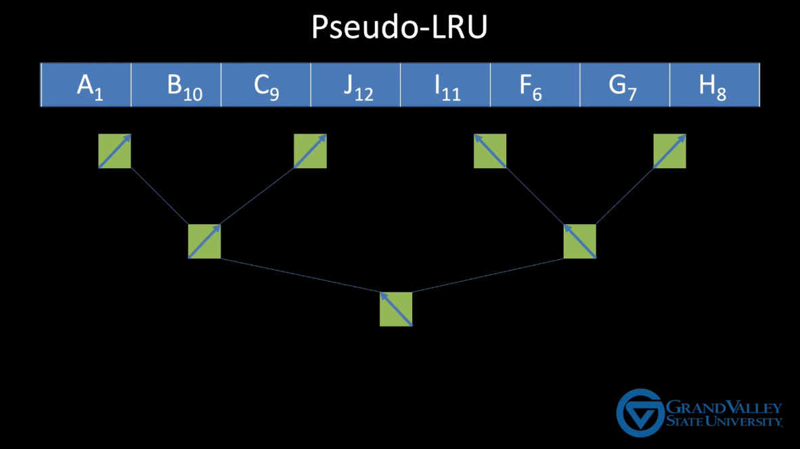
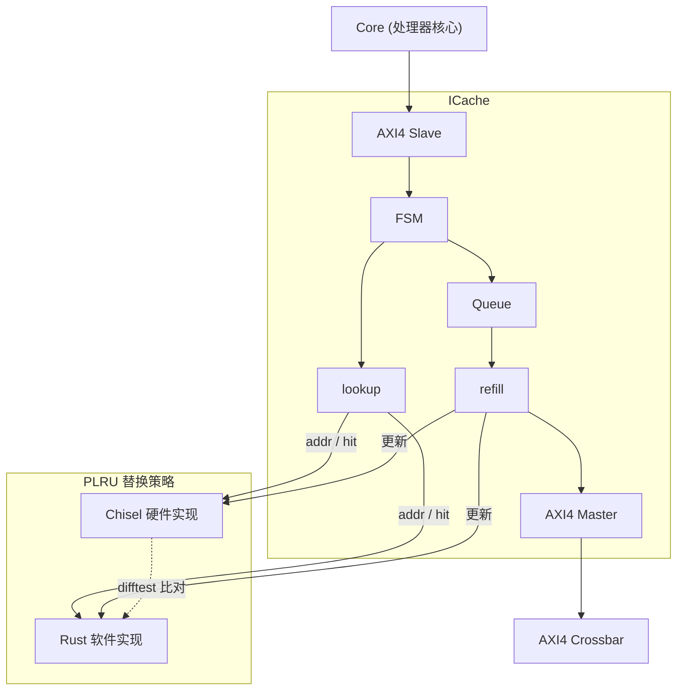

# 1 课题主要研究内容及进度

## 1.1 课题主要研究内容

本课题旨在依据 RISC-V 指令集规范[1]，设计并实现一款支持乱序执行（Out-of-Order Execution）的处理器。RISC-V 作为一种开源精简指令集架构，具有模块化、可扩展的设计特点，已在学术界和工业界得到广泛应用。乱序执行技术通过动态检测指令间的数据依赖关系，在不违反程序语义的前提下重新排列指令的执行顺序，充分挖掘指令级并行性（ILP），是现代高性能处理器微架构的核心支柱[2]。本课题从底层构建完整的处理器系统，主要研究内容包括以下几个方面：

1. **多周期基础处理器的设计与实现**。使用 Chisel 硬件描述语言[15]实现支持 RV32IM 指令集的多周期处理器核心，采用有限状态机（FSM）驱动的数据通路。将处理器核与 AXI4 总线[21]、存储控制器、UART 等外设集成为完整的 SoC 系统，构建后续乱序设计的基础平台。

2. **乱序执行微架构的设计与实现**。在基础处理器之上，设计并实现支持顺序发射、乱序执行、顺序提交的微架构。核心模块包括：寄存器重命名（Register Renaming）[5]、发射队列（Issue Queue）与动态调度、重排序缓冲区（ROB）[6]与顺序提交、分支预测器[7]等。

3. **缓存子系统设计**。设计并实现指令缓存（ICache）和数据缓存（DCache），研究缓存替换策略（如 PLRU）、AXI 突发传输（Burst Transfer）、缓存一致性（通过 fence.i 指令）等关键技术。

4. **系统软件适配与操作系统引导**。根据 RISC-V 特权规范[11]实现 M-mode 和 S-mode 的 CSR、中断与异常处理机制、Sv32 虚拟内存机制等，在处理器上运行 RT-Thread 实时操作系统和 xv6[10] 教学操作系统，验证处理器的功能完整性和系统兼容性。进阶目标为引导 Linux 内核启动。

5. **验证基础设施与仿真平台建设**。构建完善的处理器验证体系，包括基于 Spike[19] 的差分测试（DiffTest）框架、类似 GDB 的简易调试器（SDB）、多种追踪工具（itrace/mtrace/ftrace/etrace）、以及使用 Rust 构建的高性能仿真平台。

## 1.2 进度介绍

本课题自 2025 年 12 月 27 日正式启动，截至 2026 年 3 月 8 日，历时约 10 周。对照开题报告中的进度规划，原计划第一阶段"基础处理器设计与 SoC 集成"（2026 年 1 月—2 月）的工作已全部完成，第二阶段"乱序执行微架构设计"（2026 年 2 月—3 月）的前置工作——总线系统优化、SoC 外设完善、缓存子系统初步实现——已基本就绪。

具体而言，已完成的工作包括：基于 Rust 的仿真平台与调试基础设施（集成 Spike 差分测试、Capstone 反汇编、SDB 调试器）的搭建；支持 RV32IM 指令集的多周期处理器核心设计，包含完整的 M-mode 异常处理机制和 CSR 支持；基于 AXI 协议的总线系统设计与 SoC 集成，涵盖 Flash（SPI/XIP）、PSRAM（QPI）、SDRAM 等多层次存储设备以及 UART、GPIO、PS2 键盘等外围设备的接入；指令缓存（ICache）的初步实现（支持 WRAP 突发传输和 PLRU 替换策略）；以及系统性的文献调研（研读了 Alpha 21264、MIPS R10000 等经典处理器架构论文和 CMU 18-447 课程）。RT-Thread 实时操作系统已在处理器上成功运行。整体进度符合预期规划。

# 2 已完成的研究工作及结果

## 2.1 仿真平台与调试基础设施

本课题使用 Rust 语言构建了处理器的仿真平台与调试基础设施，为处理器硬件设计提供了完整的开发、调试和验证环境。

**仿真平台**：基于 Verilator 将 Chisel 生成的 Verilog 代码编译为 C++ 仿真模型，并使用 Rust 通过 FFI（Foreign Function Interface）封装为统一的仿真框架。仿真平台集成了以下关键组件：

1. Fork 了 Spike[19]（RISC-V 官方指令集模拟器）作为差分测试的参考模型（Golden Model），并修改了部分源码以适配当前处理器仅支持 M-mode 的 ecall 和 mret 指令的实现现状，使 Spike 的特权级行为与处理器硬件保持一致。修改后的 Spike 以静态库的形式融入仿真平台，采用分离编译、统一链接的方式集成。
2. 集成了 Capstone 反汇编引擎，支持在仿真过程中对执行的机器码进行实时反汇编，便于指令流的可视化分析和调试。
3. 集成了 NVBoard 虚拟 FPGA 开发板，提供 LED、数码管、拨码开关、PS2 键盘、VGA 显示等外设的可视化仿真环境。

**简易调试器（SDB）**：在仿真平台中实现了类似 GDB 的简易调试器（Simple Debugger），支持以下功能：
- 表达式求值：采用编译原理方法实现，支持算术运算、逻辑运算、寄存器引用、内存解引用等复杂表达式的解析与求值；
- 断点（Breakpoint）：支持在指定地址或符号处设置断点，程序执行到断点时暂停；
- 监视点（Watchpoint）：支持对任意表达式设置监视，当表达式的值发生变化时自动暂停执行，便于追踪特定变量或内存地址的状态变化。
- 内存计分板（Scoreboard）：在差分测试过程中同步追踪 DUT 与参考模型的内存写入操作，逐字节比对两者的存储器状态，确保内存数据的一致性；
- 缓存行为验证：在软件层面实现了与硬件 ICache 相同的 PLRU 替换策略，通过 DPI-C 回调获取硬件 ICache 的替换决策，与软件模型的预期结果进行比对，用于检测缓存替换逻辑中的性能 bug。

**追踪机制**：实现了多种追踪工具辅助调试：指令环形缓冲区（iringbuf）用于在程序异常时回溯最近执行的指令序列；访存追踪（mtrace）记录内存读写操作；函数调用追踪（ftrace）基于 ELF 文件符号表信息，通过识别 `jal` 和 `jalr` 指令的调用/返回模式实现函数调用链的追踪与可视化显示。

仿真平台的源码结构如图 2-1 所示。整体按功能划分为五个模块：`ffi` 目录封装了 Verilator、Spike、NVBoard 三个 C/C++ 外部库的桥接层；`libcpu` 目录抽象了 CPU 模型接口，统一了 Spike 参考模型与 Verilator 硬件仿真模型的操作接口，使差分测试框架能以统一方式驱动两者；`libdpi` 目录实现了 DPI-C 回调机制，用于在 RTL 仿真中拦截和记录 ICache、访存等硬件行为；`libsdb` 目录实现了简易调试器的全部功能；`tracer` 目录实现了各类追踪工具。

```
src/rust
├── args.rs
├── ffi
│   ├── mod.rs
│   ├── nvboard_bridge.cc
│   ├── nvboard_bridge.h
│   ├── spike_bridge.cc
│   ├── spike_bridge.h
│   ├── verilator_bridge.cc
│   └── verilator_bridge.h
├── libcpu
│   ├── abstract_cpu.rs
│   ├── mod.rs
│   ├── spike.rs
│   └── verilator
│       ├── cpu.rs
│       └── mod.rs
├── libdpi
│   ├── dpi.rs
│   ├── globals.rs
│   ├── icache.rs
│   ├── mod.rs
│   └── target.rs
├── lib.rs
├── libsdb
│   ├── command.rs
│   ├── expression.rs
│   ├── mod.rs
│   ├── scoreboard.rs
│   ├── sdb.rs
│   └── watchpoint.rs
├── main.rs
└── tracer
    ├── dtrace.rs
    ├── ftrace.rs
    ├── itrace.rs
    ├── mod.rs
    ├── mtrace.rs
    └── ringbuf.rs
```

## 2.2 多周期处理器核心设计

### 2.2.1 状态机驱动的多周期数据通路

处理器核心使用 Chisel 硬件描述语言[15]进行设计，采用有限状态机（FSM）驱动的多周期微架构。多周期设计通过状态机灵活控制每条指令的执行节拍数，天然适配不同延迟的总线与外设响应——当总线或外设响应较慢时，状态机在等待状态停留更多周期；当响应快速完成时，状态机立即推进到下一阶段，无需固定的流水线级数划分。

处理器核心的状态转移如图 2-2 所示，包含 7 个状态。正常执行流程为：ifu.ready.wait 等待取指单元就绪后进入 IDLE，由 step 信号启动取指进入 ifu.valid.wait；取指有效后根据是否为访存指令分流——访存指令经 mem.ready.wait → memValid.wait 完成存储器握手后进入 WB 写回，非访存指令直接进入 exception 进行异常检查；WB 完成后回到 ifu.ready.wait 等待下一条指令。异常与中断来源有三处：IFU/CU 异常（取指阶段的非法指令等）、LSU 异常（访存阶段的 Access Fault 等）和外部中断（WB 阶段检测的定时器中断等），均统一汇入 exception 状态处理后回到 ifu.ready.wait 重新取指。



设计过程经历了从单周期到多周期的演进。初期实现了单周期处理器（miniRV）用于验证基本数据通路的正确性，但单周期设计假设所有存储器读取均为异步组合逻辑——即在同一时钟周期内即可获得数据，这在实际处理器中是不可行的：真实系统中处理器核心通过总线协议（如 AXI）与存储器和外设通信，访存操作需要经历握手和等待，延迟不可预知。因此，本课题随后将处理器重构为状态机驱动的多周期架构，使其能够正确处理总线握手带来的不定长延迟，为后续实现流水线打下坚实的基础。

在译码器设计方面，初期采用手工编写的译码逻辑，后期使用 Chisel 提供的 Decoder 工具进行重构，通过声明式的方式描述指令编码与控制信号的映射关系，提高了译码器的可读性和可维护性，并可通过 espresso 进行译码逻辑化简。

处理器核心支持完整的 RV32I 指令集，包括算术逻辑运算（ADD/SUB/AND/OR/XOR/SLT 等）、立即数运算、加载/存储指令（LW/SW/LB/SB 等）、分支跳转指令（BEQ/BNE/BLT/JAL/JALR 等）以及系统指令（ECALL/EBREAK/CSR 操作等）。

### 2.2.2 异常处理与中断机制

为支持操作系统运行，处理器实现了 RISC-V 特权架构规范[11]中机器模式（M-mode）的异常处理机制：

**控制状态寄存器（CSR）**：支持 mstatus（机器状态寄存器）、mtvec（异常向量基址寄存器）、mepc（异常程序计数器）、mcause（异常原因寄存器）等关键 CSR，以及 CSR 读写指令（csrrw、csrrs、csrrc 及其立即数变体）。

**异常响应机制**：支持 ecall 指令触发的同步异常。处理器在检测到异常时保存当前 PC 至 mepc，将异常原因写入 mcause，并跳转至 mtvec 指定的异常处理程序入口。同时支持 mret 指令从异常处理程序返回。

基于上述异常处理与中断机制，处理器已成功运行 RT-Thread 实时操作系统，验证了上下文切换、定时器中断驱动的任务调度等系统级功能的正确性。

## 2.3 总线系统与 SoC 集成

### 2.3.1 SoC 整体架构

SoC 系统的整体架构如图 2-3 所示。处理器核心通过 AXI4 主接口连接到一级 AXI4 Crossbar，一级 Crossbar 下挂 SDRAM 控制器（经 AXI4 Delayer 模拟真实访存延迟）和二级 AXI4 Crossbar（经 AXI4 Fragmenter 将突发传输拆分为单拍事务、AXI4 UserYanker 处理用户信号）。二级 Crossbar 下挂 MROM、SRAM 以及 APB 总线域（经 AXI4ToAPB 桥进行协议转换）。APB Fanout 将地址空间分发至各低速外设：UART 16550、PSRAM QSPI Master、GPIO、PS2 键盘、VGA 控制器、XIP Flash 控制器，以及 SPI 控制器。其中 XIP Flash 控制器与 APB Fanout 通过 SPI Arbiter 共享物理 SPI 控制器的访问权——XIP 控制器以较高优先级发起 SPI 事务用于 eXecute In Place 访问，APB Fanout 以较低优先级提供 SPI 寄存器的直接读写通道。



### 2.3.2 总线系统设计

SoC 的总线系统设计充分考虑了不同外设相对于 CPU 的速率差距，采用分层总线架构，为不同速率的设备选取合适的总线协议：

**高速域（AXI4）**：处理器核心通过 AXI4 协议[21]（支持突发传输、乱序响应等特性）连接一级 AXI4 Crossbar。SDRAM 控制器直接挂载在一级 Crossbar 上，以最短路径获得最高带宽，满足主存储器的高吞吐需求。

**中速域（AXI4 Crossbar 2）**：二级 Crossbar 通过 AXI4 Fragmenter（将突发传输拆分为单拍事务，适配不支持突发的从设备）和 AXI4 UserYanker（剥离 AXI4 用户自定义信号，适配不同协议接口间的信号宽度差异）连接到一级 Crossbar。MROM 和 SRAM 挂载在此域。

**低速域（APB）**：通过 AXI4ToAPB 总线桥将 AXI4 事务转换为 APB 协议，连接 UART、GPIO、PS2 键盘、VGA、SPI 控制器、PSRAM QSPI Master 等低速外设。APB 协议省去了突发传输和乱序响应等复杂机制，以较低的硬件开销满足低速外设的访问需求。

此外，SoC 配置了多片物理存储器以满足不同应用场景的需求：MROM 用于存放 Bootloader 启动代码、SRAM 提供低延迟的片上存储、Flash 提供非易失性程序存储（支持 XIP 直接执行）、PSRAM 和 SDRAM 分别提供不同容量和带宽的主存储空间。

### 2.3.3 存储子系统设计

存储子系统是 SoC 系统的核心组成部分，本课题实现了多层次的存储架构：

**MROM（Mask ROM）**：在 CPU 接入 SoC 初期、尚未接入 SPI Flash 时使用的一块只读存储器，用于存放指令和只读数据。MROM 对应的是早期半导体技术尚不成熟时的一种存储方案——出厂时即被掩膜初始化，此后不可重新刷写。当前 SoC 已通过 Flash 替代 MROM 作为主要的启动存储，MROM 仅作为最小引导代码的存放区域保留。

**Flash 存储器（SPI/XIP）**：通过 SPI 协议访问外部 Flash。SPI Master 选取了 OpenCores 开源的 IP 核（2004/03/15 版本，基于 Wishbone 总线接口），并使用 Chisel 实现了一层 APB-to-Wishbone 的薄封装以接入 SoC 的 APB 总线域。在仿真模型方面，参照 Winbond W25Q128JVSIQ 手册中描述的时序和命令字，实现了该 Flash 芯片的行为级仿真模型，并进行了类 UVM 的验证测试，确保 SPI 控制器的协议实现与真实芯片完全兼容——这意味着后续上板乃至流片时，Flash 控制器可以直接对接物理 Flash 芯片而无需修改。实现了两种访问方式：一是通过 APB Fanout 经 SPI Arbiter 以命令方式直接读写 SPI 控制器寄存器；二是通过 XIP（eXecute In Place）控制器将 Flash 地址空间映射到处理器的统一地址空间，XIP 控制器自动将 CPU 的存储器读请求转换为 SPI 读命令，允许处理器直接从 Flash 取指执行。XIP 控制器与直接寄存器访问通过 SPI Arbiter 共享物理 SPI 控制器，XIP 具有更高的仲裁优先级。

**PSRAM（Pseudo-SRAM）**：通过 QSPI（Quad SPI）协议访问外部 PSRAM。本课题参考 OpenCores 的 SPI 设计思路，使用 Chisel 重新实现了完整的 QSPI Master 控制器，采用 APB 接口，支持从 QSPI 模式切换到 QPI 模式（四线半双工）。控制器内部由时钟分频器（Clgen）和移位寄存器（Shift）两个子模块构成，通过状态机协调 APB 总线事务与 SPI 串行传输的时序关系。



在仿真模型方面，参照 ISSI IS66WVS4M8ALL/BLL 手册中描述的命令字和时序规范，实现了 PSRAM 颗粒的行为级仿真模型，用于在 Verilator 仿真环境中验证 QSPI 控制器的协议正确性。

**SDRAM 控制器**：为提供较大容量的主存储空间，将 SDRAM 控制器挂载在一级 AXI4 Crossbar 上（经 AXI4 Delayer 模拟真实访存延迟）。本课题参考 ultraembedded 开源的 SDRAM 控制器（Verilog 实现），使用 Chisel 进行了完整重写，以便于后续的参数化扩展和与 SoC 其他 Chisel 模块的统一维护。重写后的控制器利用 Chisel 内置的 Queue 模块对请求和响应通路进行解耦，使得控制器的流水化程度高于原始 Verilog 版本，并实现了位扩展（单颗粒 16bit 数据宽度，双颗粒则是 32bit）和字扩展（双颗粒并联 32 位数据宽度）两种配置。字扩展采用低位交叉（Low-order Interleaving）方式，如图 2-5 所示：两个 SDRAM Core 分别映射到地址的奇偶字，AXI4 交叉开关将连续地址的访问分发到不同的 Core，使两颗粒可以并行处理不同地址的请求，提高访存并发度。



在仿真模型方面，参照 Micron MT48LC16M16A2 手册实现了 SDRAM 颗粒的行为级仿真模型，准确模拟了 ACTIVATE、READ、WRITE、PRECHARGE、AUTO REFRESH 等命令的时序行为，并通过了 ultraembedded 提供的基于 SystemC 的 UVM 仿真测试，验证了控制器实现的协议正确性。

**Bootloader 设计**：实现了二级引导加载程序，启动流程如图 2-6 所示。处理器上电后从 XIP Flash 中执行 `_start`，初始化栈指针（SP）；随后进入一级引导程序（FSBL），通过 XIP 方式从 Flash 中将二级引导程序（SSBL）加载到 SDRAM 并跳转执行；SSBL 在 SDRAM 中运行，负责将应用程序从 Flash 加载到 SDRAM 并跳转至 `trm_init`；`trm_init` 完成运行时环境的初始化——包括外设初始化（如 UART 波特率配置）、参考 RISC-V PK 加载自定义的 mtvec 异常向量以建立裸机异常处理环境（防止程序跑飞时无法定位问题）；最后跳转到 `main` 进入用户应用程序。注意：这里的 “应用程序” 并不是类似手机中的 App，这里的 “应用程序” 可以是 操作系统，比方说 RT-Thread 。



### 2.3.3 外围设备集成

在 SoC 系统中集成了多种外围设备：

**GPIO 控制器**：支持通过程序控制 NVBoard 上的 LED 流水灯、读取拨码开关状态、在 7 段数码管上展示学号的后八位等功能。

**UART 串口控制器**：采用 OpenCores 开源的 16550 兼容 UART 控制器，将原始的 Wishbone 总线接口在 Chisel 层封装为 APB 接口以接入 SoC。串口的 TX/RX 引脚接入 NVBoard 的虚拟终端进行仿真测试，两端配置了匹配的波特率以确保通信正确。

**PS2 键盘控制器**：参考南京大学数字电路实验文档，使用 Chisel 实现了 PS2 协议的键盘控制器，支持从 NVBoard 读取键盘按键的扫描码。

**VGA 控制器**：参考南京大学数字电路实验文档，使用 Chisel 实现了 VGA 显示控制器。如图 2-7 所示，CPU 通过 APB Fanout 将像素数据写入显存，VGA 控制器内部的交叉开关仲裁 CPU 写入与显示扫描的访问冲突，显示端按照标准 VGA 时序从显存中读取像素数据并输出到 NVBoard 的虚拟显示器。



**NVBoard 集成**：NVBoard 是南京大学开源的虚拟 FPGA 开发板仿真环境，通过 SDL2 图形库在软件层面模拟真实 FPGA 开发板上的各类外设（LED、七段数码管、拨码开关、PS2 键盘、VGA 显示器等），使开发者无需物理硬件即可在 Verilator 仿真中获得可视化的外设交互体验。本课题将 NVBoard 接入 Rust 仿真平台，与 SoC 的 GPIO、UART、PS2、VGA 等控制器对接，实现了完整的外设可视化仿真。效果如图 2-8 所示



左上角的七段数码管显示笔者学号的后 8 位；右上角为 UART 串口终端的回显输出；右下角连接了 SoC 的 PS2 键盘控制器，可接收键盘输入；左下角为 VGA 虚拟显示器，当前正在 RT-Thread 上运行“贪吃蛇”应用程序。

## 2.4 缓存子系统设计

为降低处理器核心的访存延迟，本课题设计并实现了缓存子系统。目前已完成 L1 指令缓存（ICache）的设计与验证，数据缓存（DCache）仍在开发中。

ICache 当前的参数配置为：4 路组相联（4-way Set Associative）、缓存行大小 64 字节、64 组（Set），总数据容量为 16 KB，替换策略采用伪 LRU（Pseudo-LRU, PLRU）。该参数参考了香山处理器昆明湖架构的配置方案。当前阶段以功能实现为主，暂未进行参数调优；后续系统搭建完毕后，将通过综合工具（如 yosys-sta）分析组合逻辑延迟，并结合性能计数器观测时序行为，对缓存容量、路数等参数进行面积与性能的权衡优化。

ICache 采用组相联映射结构，通过 AXI4 总线接口访问下级存储器。其状态转移如图 2-9 所示，包含 6 个状态：Idle 为初始就绪状态；当处理器核心发出有效访问请求时进入 lookup 进行标签比较，若核心暂未发出有效请求则在 v_wait 状态等待有效信号；lookup 命中后直接返回 Idle，若核心未就绪接收数据则在 r_wait 状态等待就绪信号；lookup 缺失后进入 await 等待 AXI 读通道就绪，随后进入 refill 状态接收突发传输数据。在缓存缺失（Cache Miss）时，ICache 利用 AXI 协议的突发传输（Burst Transfer）功能，以 WRAP 模式一次性读取一个完整的缓存行——WRAP 模式从缺失地址对应的偏移量开始传输，到达缓存行末尾后回绕（Wrap Around）到起始地址继续传输，使处理器可在收到第一拍数据时就开始执行，实现关键字优先（Critical Word First），有效降低缓存缺失的等待延迟。



在缓存替换策略方面，采用伪 LRU（PLRU）算法。PLRU 通过维护一棵二叉树的路径位来近似 LRU 的替换决策，其硬件开销远小于完全 LRU，适合在面积受限的场景下使用。



ICache 的硬件架构如图 2-10 所示。处理器核心通过 AXI4 Slave 接口发起访存请求，FSM（状态机）根据当前状态将请求分发至 lookup 模块（标签比较）或通过 Queue（请求队列）送入 refill 模块（缓存行填充）；refill 完成后通过 AXI4 Master 接口经 AXI4 Crossbar 访问下级存储器。为验证缓存替换逻辑的正确性，本课题在 PLRU 替换策略上实施了缓存层级的差分测试：lookup 和 refill 模块同时连接了 Chisel 硬件实现和 Rust 软件实现两套 PLRU 模型，通过 DPI-C 回调在每次替换决策时比对两者的命中信号（hit）是否一致。这一机制的必要性在于：即使缓存替换策略存在缺陷，处理器仍能正确执行每条指令（因缺失后总会从下级存储器取回正确数据），传统的指令级差分测试无法检测此类性能缺陷，而缓存层级的差分测试则可以及时发现替换逻辑中的问题。



## 2.5 验证基础设施与仿真平台

### 2.5.1 差分测试框架

差分测试（DiffTest）[18]是本课题采用的核心验证方法。其原理是将待验证的处理器（DUT）与经过充分验证的参考模型（golden model）同步执行相同程序，在每条指令执行后比较两者的体系结构状态（通用寄存器、PC、CSR、Store指令写入地址的内容），若不一致则说明 DUT 存在 bug。

参考模型采用 Spike[19]（RISC-V 官方指令集模拟器）。如 2.1 节所述，本课题 fork 了 Spike 并修改部分源码以适配当前处理器的 M-mode 特权级实现，将其以静态库形式融入 Rust 仿真平台中。同时集成了 Capstone 反汇编引擎，支持在仿真过程中对机器码进行实时反汇编，辅助指令流分析。DiffTest 框架在处理器开发过程中持续发挥作用，已帮助定位并修复了多个微架构实现中的功能缺陷。

### 2.5.2 仿真平台的技术选型

仿真平台选择 Rust 语言开发（详见 2.1 节），主要基于以下考量：相较于 C++，Rust 具有更现代的语言设计和更优雅的抽象能力——其代数数据类型（enum）与模式匹配使状态机和协议解析的表达更加简洁清晰，trait 系统提供了比 C++ 模板更直观的泛型约束机制，这些特性使仿真平台中涉及多种 CPU 模型抽象、DPI-C 回调分发等复杂逻辑的代码更易编写和维护；Rust 的构建工具 Cargo 和 `build.rs` 机制简化了跨语言编译和链接的管理，能够方便地将 Spike、Capstone、Verilator 等 C/C++ 外部库统一集成；Rust 的 FFI 能力使其能够与 C/C++ 库无缝互操作。

此外，使用 Nix 包管理器统一管理各子项目的依赖和构建环境，确保构建的可重现性。

## 2.6 理论研究与文献调研

为后续乱序处理器的设计奠定理论基础，本课题系统性地开展了文献调研，主要涉及以下方面：

**超标量处理器架构**：研读了 Smith 和 Sohi 的综述论文"The Microarchitecture of Superscalar Processors"[2]，系统了解了超标量处理器各阶段的设计要点。研读了 Alpha 21264 和 MIPS R10000 处理器的架构论文，深入理解了工业级乱序处理器的设计方案。Alpha 21264 采用了 Wait Table 机制处理乱序访存的 Memory Ordering Violation 问题；MIPS R10000 采用了 Checkpoint 机制（而非 ROB）进行状态恢复，并使用了 Virtual Index Physical Tag 的缓存索引方案。

**精确异常**：研读了"Implementing Precise Interrupts in Pipelined Processors"[5]论文，了解了 Result Shift Register 等早期精确异常方案——该方案通过数节拍的机制控制指令提交，基于已知的执行单元延迟周期数，但无法处理访存等不定长延迟操作，因此现代处理器一般采用 ROB 配合握手机制实现精确异常。

**分支预测**：研读了 Yeh 和 Patt 的两级自适应分支预测论文[7]，了解了局部分支预测、全局分支寄存器（GBR）、GSelect、GShare 等预测算法的原理，以及通过锦标赛（Tournament）机制将多种预测算法组合使用的方法。

**体系结构课程与参考书籍**：系统学习了 CMU 18-447 计算机体系结构课程的相关内容。研读了《自己动手写 CPU》、《CPU 设计实战》、《超标量处理器设计》以及"System Design on SystemC"等书籍，参考了蜂鸟 E203[14] 和 BOOM[8] 等开源处理器的设计实现。

# 3 后期拟完成的研究工作及进度安排

## 3.1 后期拟完成的研究工作

后续需要完成的工作主要包括以下三个方面，对应开题报告中第二、三阶段的研究计划：

### 3.1.1 数据缓存设计与实现

在已有 ICache 的基础上，设计并实现 L1 数据缓存（DCache）。DCache 需支持写回（Write-back）策略和写分配（Write-allocate）机制，通过 AXI4 突发传输访问下级存储器。实现 fence.i 指令以保证指令缓存与数据缓存之间的一致性。同时实现性能计数器（Performance Counters），统计 IPC、缓存命中率等关键性能指标，为后续微架构优化提供数据支撑。

### 3.1.2 单发射乱序执行动态流水线设计

这是本课题最核心也最具挑战性的部分。将当前的多周期处理器重构为单发射、乱序执行的动态流水线微架构。按照开题报告中的设计规划，采用自底向上的增量式开发策略：

1. 实现物理寄存器堆（Physical Register File）和空闲列表（Free List）；
2. 实现基于 RAT（Register Alias Table）的寄存器重命名模块，消除 WAR 和 WAW 伪依赖[5]，支持快照恢复（Snapshot Recovery）；
3. 实现发射队列（Issue Queue）和选择逻辑（Select Logic），采用最老优先策略；
4. 实现 ROB 和顺序提交逻辑[6]，支持精确异常和推测执行的状态回滚；
5. 实现各功能单元（ALU、Branch Unit、LSU），LSU 需实现 Store Buffer 以支持 Store-to-Load Forwarding；
6. 实现分支预测器（BHT + BTB + RAS）[7]；
7. 整合前端（取指、译码、重命名、分配）与后端（发射、执行、提交），完成乱序处理器的整体集成。

### 3.1.3 RV64I 扩展与完整三级特权架构

将处理器的指令集从 RV32IM 扩展至 RV64I，适配 64 位数据通路和地址空间。在特权架构方面，实现完整的 M/S/U 三级特权模式，包括 S-mode CSR 寄存器组、trap delegation 机制（medeleg/mideleg、mret/sret 指令）、Sv39 页表遍历硬件（PTW），以及 PLIC 外部中断控制器[24]。在处理器上移植并运行 xv6-riscv[10] 操作系统，验证进程管理、虚拟内存、文件系统等系统级功能。进阶目标为适配 OpenSBI[22] 和 U-Boot[23]，尝试引导 Linux 内核启动。

## 3.2 进度安排

对照开题报告的进度规划，结合当前实际进展，后期工作安排如下：

**2026 年 3 月上旬——2026 年 3 月下旬**：完成数据缓存（DCache）的设计与实现。在已有 ICache 的基础上，设计支持写回（Write-back）策略和写分配（Write-allocate）机制的 DCache，实现 fence.i 指令以保证 ICache 与 DCache 的一致性，并实现性能计数器以支持后续性能评估。

**2026 年 3 月下旬——2026 年 4 月中旬**：完成单发射乱序执行动态流水线的设计与实现。将当前的多周期处理器重构为动态流水线架构，按 3.1.2 节所述的自底向上策略，逐步实现物理寄存器堆、寄存器重命名（RAT）、发射队列、ROB、LSU（含 Store Buffer）、分支预测器（BHT + BTB + RAS）等核心模块，完成前后端整合。采用 DiffTest 进行逐指令验证，使用 riscv-torture 进行随机压力测试，运行 Coremark[26]、Dhrystone[27] 等基准测试评估性能。

**2026 年 4 月中旬——2026 年 5 月上旬**：完成 RV64I 指令集扩展与完整三级特权架构的实现。将处理器从 RV32IM 扩展至 RV64I，实现 M/S/U 三级特权模式、trap delegation（medeleg/mideleg）、S-mode CSR 寄存器组、Sv39 页表遍历硬件（PTW）、PLIC 外部中断控制器。在处理器上移植并运行 xv6-riscv[10] 操作系统，验证进程管理、虚拟内存等系统级功能。进阶目标为适配 OpenSBI[22] 和 U-Boot[23]，尝试引导 Linux 内核启动。

**2026 年 5 月上旬——2026 年 5 月中旬**：整理实验数据与性能评估结果，撰写并完善毕业论文，准备毕业答辩。

# 4 存在的困难及解决方案

## 4.1 存在的困难

1. **乱序执行逻辑复杂度高**。乱序执行微架构涉及寄存器重命名、动态调度、推测执行与精确恢复等多个紧密耦合的模块，设计与调试难度大。特别是乱序访存单元的设计，需处理 Load-Store 之间的 RAW 依赖和 Memory Ordering Violation 问题。

2. **验证覆盖率难以保障**。处理器设计的状态空间极大，仅靠手写测试用例难以覆盖所有边界情况，尤其是乱序执行中各种指令交织、异常中断嵌套等复杂场景。

3. **缓存一致性问题**。在实现 ICache 后，Bootloader 加载程序到 SDRAM 并跳转执行时，ICache 中仍缓存着旧指令数据，导致执行错误。在后续实现 DCache 后，ICache 与 DCache 之间的一致性问题将更加复杂。

4. **仿真速度与设计规模的矛盾**。随着 SoC 复杂度增长，RTL 仿真速度持续下降，影响开发迭代效率。

5. **操作系统引导涉及特权级适配**。运行操作系统需处理器正确实现特权级切换、中断异常处理、虚拟内存等复杂机制，实现细节繁多且容易出错。

## 4.2 解决方案

1. **针对乱序执行复杂度**：采用自底向上的增量式开发策略，每引入一个模块即进行充分测试，确保正确性后再进入下一步。参考 BOOM[8] 和香山处理器[9]的开源代码作为设计参照。利用 Chisel 的参数化生成能力，使 ROB 深度、发射队列大小、物理寄存器数量等关键参数可灵活配置，便于在不同复杂度级别间切换和调试。对于乱序访存，初期采用保守的顺序访存策略，待核心功能验证通过后再实现 Store Buffer 和 Store-to-Load Forwarding。

2. **针对验证覆盖率**：建立多层次验证体系。第一层使用 riscv-arch-test[17] 进行指令级合规性验证；第二层采用 DiffTest 差分测试，以 Spike 为参考模型进行长时间随机测试（riscv-torture），自动检测架构状态偏差；第三层通过运行 RT-Thread、xv6、Linux 等操作系统进行系统级验证。三层验证互相补充、层层递进。

3. **针对缓存一致性**：严格按照 RISC-V 规范实现 fence.i 指令，在执行该指令时刷新 ICache 中的所有缓存行。在 Bootloader 中，跳转到新加载程序之前插入 fence.i 指令。

4. **针对仿真速度**：通过 Rust 重写仿真平台提升框架本身的效率；利用 cachesim 和 branchsim 等软件模拟器进行设计空间探索，减少不必要的 RTL 仿真；对功能测试进行分级，日常开发使用轻量级测试集，定期执行完整回归测试。

5. **针对操作系统引导**：严格遵循 RISC-V 特权规范[11]，逐项实现和验证各项特权功能。优先选择 xv6 这一代码精简的操作系统作为首个验证目标，在其通过后再尝试 Linux 内核引导。充分利用仿真环境中的波形追踪（VCD/FST）和日志输出定位特权级相关的功能缺陷。

# 5 论文按时完成的可能性

本课题目前已完成约 60% 的工作量，对照开题报告中的三阶段规划，第一阶段"基础处理器设计与 SoC 集成"已全部完成，第二阶段"乱序执行微架构设计"的前置工作已基本就绪。

**已完成的工作**：基于 Rust 的仿真平台与调试基础设施（集成 Spike 差分测试、Capstone 反汇编、SDB 调试器）已搭建完成并投入使用；多周期处理器核心实现了完整的 RV32I 指令集和 M-mode 异常处理机制；SoC 系统集成基本完成，涵盖 AXI 总线系统、多层次存储架构（MROM/SRAM/Flash/PSRAM/SDRAM）、多种外围设备（UART/GPIO/PS2/VGA）；Cache 子系统完成初步实现；RT-Thread 实时操作系统已在处理器上成功运行。

**理论储备**：通过系统的文献调研（Alpha 21264、MIPS R10000、分支预测等经典论文以及 CMU 18-447 课程），为乱序执行引擎的设计积累了充分的理论基础。开题报告中已完成详细的乱序微架构设计文档，明确了各模块的接口定义和实现方案。

**工程基础**：项目启动 10 周以来平均每日投入 8-14 小时的有效工作时间，保持了高强度的开发节奏。已建立的完善验证基础设施（DiffTest、多种 trace 工具、Rust 仿真平台）和工程管理机制（Nix 构建环境、Bug Report 体系）将显著加速后续开发与调试。

**风险控制**：后续工作的主要挑战在于乱序执行引擎的实现，预计需要约 4-5 周时间。进度安排中为各阶段留有适当余量；即使乱序执行的完整实现遇到困难，流水线处理器本身已是一个有价值的研究成果，可保证论文的基本完整性。xv6 操作系统运行和 Linux 内核引导作为系统级验证目标，将根据乱序核的完成进度动态调整。

综上所述，论文能够按期完成，并预期取得以下研究成果：一款支持 RV64I 指令集、具备乱序执行能力的 RISC-V 处理器核心，配套的 SoC 系统和完善的验证基础设施，以及在该处理器上运行操作系统的系统级验证结果。

## 参考文献

[1] WATERMAN A, ASANOVIĆ K. The RISC-V Instruction Set Manual, Volume I: Unprivileged ISA, Document Version 20191213[S]. RISC-V Foundation, 2019.

[2] SMITH J E, SOHI G S. The microarchitecture of superscalar processors[J]. Proceedings of the IEEE, 1995, 83(12): 1609-1624.

[3] TOMASULO R M. An efficient algorithm for exploiting multiple arithmetic units[J]. IBM Journal of Research and Development, 1967, 11(1): 25-33.

[5] SMITH J E, PLEZSKUN A R. Implementing precise interrupts in pipelined processors[J]. IEEE Transactions on Computers, 1988, 37(5): 562-573.

[6] HWANG Y S, CHUNG P S. Design of a reorder buffer for high-performance processors[C]//Proceedings of the IEEE International Conference on Computer Design (ICCD). IEEE, 1996: 310-315.

[7] YEH T Y, PATT Y N. Two-level adaptive training branch prediction[C]//Proceedings of the 24th Annual International Symposium on Microarchitecture (MICRO-24). ACM, 1991: 51-61.

[8] ZHAO J, KORPAN B, GONZALEZ A, et al. SonicBOOM: The 3rd Generation Berkeley Out-of-Order Machine[C]//Fourth Workshop on Computer Architecture Research with RISC-V (CARRV), 2020.

[9] XU Y, HU Z, ZHANG L, et al. Towards Developing High Performance RISC-V Processors Using Agile Methodology[C]//Proceedings of the 55th IEEE/ACM International Symposium on Microarchitecture (MICRO). IEEE, 2022: 1178-1199.

[10] COX R, KAASHOEK M F, MORRIS R. Xv6, a simple Unix-like teaching operating system[EB/OL]. MIT, 2024. https://pdos.csail.mit.edu/6.828/xv6.

[11] WATERMAN A, ASANOVIĆ K. The RISC-V Instruction Set Manual, Volume II: Privileged Architecture, Document Version 20211203[S]. RISC-V International, 2021.

[14] 胡振波. 手把手教你设计CPU——RISC-V处理器篇[M]. 人民邮电出版社, 2018.

[15] BACHRACH J, VO H, RICHARDS B, et al. Chisel: Constructing Hardware in a Scala Embedded Language[C]//Proceedings of the 49th Annual Design Automation Conference (DAC). ACM, 2012: 1216-1225.

[17] RISC-V International. RISC-V Architecture Test Suite[EB/OL]. [2026-01-15]. https://github.com/riscv-non-isa/riscv-arch-test.

[18] 余子濠, 刘志刚, 包云岗. 处理器芯片敏捷设计方法: 问题与挑战[J]. 计算机研究与发展, 2021, 58(6): 1152-1163.

[19] RISC-V International. Spike RISC-V ISA Simulator[EB/OL]. [2026-01-15]. https://github.com/riscv-software-src/riscv-isa-sim.

[21] ARM. AMBA AXI and ACE Protocol Specification[S]. ARM Limited, 2011.

[22] RISC-V International. OpenSBI: RISC-V Open Source Supervisor Binary Interface[EB/OL]. [2026-01-15]. https://github.com/riscv-software-src/opensbi.

[23] Article: Introduction to Das U-Boot, the universal open source bootloader[EB/OL]. [2025-10-28]. https://linuxdevices.org/introduction-to-das-u-boot-the-universal-open-source-bootloader-a/index.html.

[24] RISC-V International. RISC-V Platform-Level Interrupt Controller Specification[S]. RISC-V Foundation, 2023.

[26] EEMBC. CoreMark: An EEMBC Benchmark[EB/OL]. [2026-01-15]. https://www.eembc.org/coremark/.

[27] WEICKER R P. Dhrystone: a synthetic systems programming benchmark[J]. Communications of the ACM, 1984, 27(10): 1013-1030.
