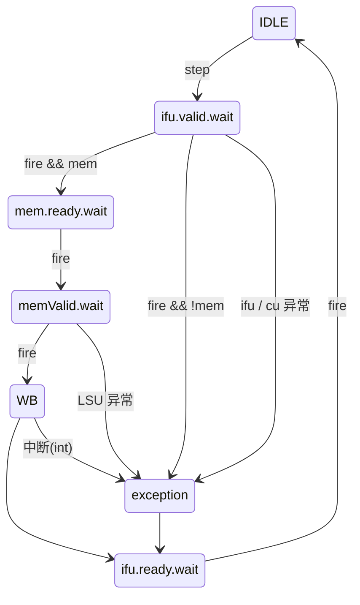

# 哈尔滨工业大学（深圳）毕业论文开题报告

## 1 课题背景及研究的目的和意义

### 1.1 课题背景

随着开源指令集架构 RISC-V[1] 的蓬勃发展，其精简、模块化、可扩展的设计理念受到了学术界和工业界的广泛关注。RISC-V 由加州大学伯克利分校于 2010 年提出，采用开放源代码许可协议，允许任何人自由设计、制造和销售基于 RISC-V 的芯片与软件，打破了传统商业指令集架构（如 x86、ARM）的授权壁垒。截至目前，RISC-V International 已拥有超过 4000 家会员单位，涵盖了从嵌入式微控制器到高性能服务器处理器的完整生态。在产业层面，RISC-V 已从学术研究走向大规模商业部署：乐鑫科技的 ESP32-C3/C6 系列采用 RISC-V 内核[32]，广泛应用于物联网终端设备；NVIDIA 已在其 GPU 中部署超过 10 亿颗 RISC-V 核心，用于视频编解码、显示控制、电源管理等片上控制功能[33]。在国内，RISC-V 的发展已上升为国家战略——2025 年，网信办、工信部、科技部等八部门联合发布指导意见，鼓励在全国范围内推广使用开源 RISC-V 芯片[34]；工信部于 2023 年成立 RISC-V 工作委员会，推动 RISC-V 在物联网、工业控制、高性能计算、智能网联汽车等领域的规模化应用[4]。

在高性能处理器设计领域，**乱序执行**（Out-of-Order Execution）[2] 是提升指令级并行度（ILP, Instruction-Level Parallelism）的关键技术。自 1967 年 Tomasulo 提出动态调度算法[3]以来，乱序执行技术经历了数十年的发展与演进，已成为现代高性能处理器微架构的核心支柱。乱序执行通过动态检测指令间的数据依赖关系，在不违反程序语义的前提下重新排列指令的执行顺序，从而有效利用功能单元的空闲周期，显著提升流水线的吞吐率。

得益于 RISC-V 的开放性，研究者可以在没有商业授权限制的条件下，从零实现一颗从前端取指到后端提交的完整处理器核，这在传统的 x86 或 ARM 体系下因指令集授权壁垒而难以实现。这一特性不仅降低了处理器设计的准入门槛，更为国产自主可控芯片的技术攻关提供了可行的技术路线，使得国内企业和科研机构能够在不依赖境外指令集授权的前提下，独立完成从微架构设计到芯片流片的全流程实践。

### 1.2 研究的目的和意义

本课题旨在依据 RISC-V 指令集规范，使用 Chisel 硬件描述语言[16]设计并实现一个支持乱序执行的处理器，并构建包含自主设计 IP 核的完整 SoC 系统。具体而言，通过引入**寄存器重命名**（Register Renaming）[5]、**发射队列**（Issue Queue）、**乱序执行单元**和**重排序缓冲区**（Reorder Buffer, ROB）[6]等核心微架构模块，解决指令间的数据相关（RAW/WAR/WAW）问题，实现指令的乱序发射、乱序执行与顺序提交。

本课题的研究意义主要体现在以下几个方面：

**服务信创产业对自主可控处理器核心技术的需求。** 在国家推动信息技术应用创新（信创）的战略背景下，掌握高性能处理器微架构的自主设计能力具有重要的现实意义[4]。RISC-V 作为不受出口管制限制的开源指令集架构，已成为国内信创生态的关键技术路线之一。本课题计划从零设计一款支持乱序执行的 RISC-V 处理器核心，完整覆盖从微架构设计、RTL 编码到系统级验证的全流程，有助于积累高性能处理器设计的关键经验，为国产处理器的自主研发提供技术储备。

**丰富 Chisel 语言的开源 IP 核生态。** 经调研发现，当前 RISC-V SoC 设计中使用的大量外设 IP 核仍以 Verilog/VHDL 实现为主，基于 Chisel 的可复用 IP 核生态尚不完善（详见 2.2 节分析）。本课题计划在构建 SoC 系统的过程中，使用 Chisel 重写 SDRAM 控制器、QSPI Master 控制器等关键外设 IP 核，并将其接入 Rocket Chip 的 Diplomacy 参数协商框架，实现总线接口的自动参数协商与地址空间的声明式配置。这些基于 Chisel 的 IP 核将具备参数化配置能力（如 SDRAM 控制器可配置位扩展与字扩展模式），可直接被其他 Chisel SoC 项目复用，有助于推动 Chisel 硬件设计生态的发展。

**填补教学级与工业级乱序处理器之间的设计空白。** 经调研发现，目前开源的 RISC-V 乱序处理器（如 BOOM[8]、香山[9]）面向工业级性能目标，微架构复杂度高、代码量大（数万至十余万行），对初学者而言理解和学习门槛较高。而高校计算机组成原理课程的实验通常止步于简单的五级流水，与真实乱序处理器之间存在显著的复杂度断层。本课题拟设计的单发射乱序处理器定位于两者之间——在保留乱序执行核心机制（寄存器重命名、动态调度、推测执行、精确异常）的前提下，控制微架构复杂度在可理解和可实现的范围内，配合完善的设计文档和验证框架，可为后续有志于体系结构方向的学习者提供一份复杂度适中、可复现的参考设计。

**构建从处理器核到操作系统的完整验证闭环。** 课题不仅关注微架构设计本身，还计划通过运行 xv6[10] 等教学操作系统以及尝试引导 Linux 内核启动来验证处理器的功能完整性和系统兼容性。

---

## 2 国内外研究现状及分析

### 2.1 国内外研究现状

#### 2.1.1 RISC-V 指令集架构

RISC-V 是一种基于精简指令集计算（RISC）原则的开源指令集架构。其设计采用模块化思想，基础整数指令集（RV32I/RV64I）仅包含约 40 条指令，在此基础上可通过标准扩展（如 M-乘除法、A-原子操作、F/D-浮点、C-压缩指令等）灵活组合以满足不同应用场景的需求[1]。

在规范层面，RISC-V 定义了三种特权级别：机器模式（M-mode）、监督模式（S-mode）和用户模式（U-mode），并规范了中断、异常处理、虚拟内存（Sv32/Sv39/Sv48）等机制[11]，为运行完整操作系统提供了架构支持。RISC-V 的开放性和模块化设计使其在产业界获得了广泛采纳——从乐鑫 ESP32 系列[32]等物联网微控制器，到 NVIDIA GPU 中的片上管理核心[33]，再到国内香山[9]等面向高性能计算的处理器设计，RISC-V 已覆盖从嵌入式到高性能的完整应用谱系。

#### 2.1.2 乱序执行技术

乱序执行的核心思想是打破程序的静态指令顺序，通过硬件动态调度来挖掘指令级并行性。其关键技术包括：

**Tomasulo 算法与保留站：** 1967 年由 Robert Tomasulo 提出[3]，通过保留站（Reservation Station）实现操作数的动态转发和指令的分布式等待，是现代乱序处理器的理论基石。

**寄存器重命名：** 通过将架构寄存器映射到更大的物理寄存器堆，消除 WAR（写后读）和 WAW（写后写）伪依赖[5]，仅保留真数据依赖（RAW），显著提高可并行执行的指令数量。常见实现方式包括基于 ROB 的重命名和基于显式重命名映射表（RAT, Register Alias Table）的方案。

**重排序缓冲区（ROB）：** 用于维护指令的程序顺序，确保乱序执行的指令能够按照原始程序顺序提交（In-Order Commit）[6]，是精确异常（Precise Exception）和推测执行（Speculative Execution）的硬件基础。

**分支预测：** 乱序处理器高度依赖分支预测来维持流水线的满载运行。现代处理器采用的分支预测器包括两级自适应预测器[7]、gshare、TAGE（Tagged Geometric History Length）[12]等，预测准确率可达 95% 以上。

#### 2.1.3 开源处理器核

**国外研究现状：**

BOOM（Berkeley Out-of-Order Machine）[8] 是加州大学伯克利分校开发的基于 RISC-V 的开源超标量乱序处理器，采用 Chisel 硬件描述语言实现，支持 RV64GC 指令集，具备可参数化的流水线宽度、ROB 深度、分支预测器等配置。BOOM 是学术界最具代表性的 RISC-V 乱序核之一，为本课题提供了重要的设计参考。

Rocket Core[13] 同样由伯克利开发，是一款顺序执行（In-Order）的 RISC-V 处理器核，采用经典的五级流水线设计，支持 RV64GC 指令集。Rocket 的 SoC 生成框架 Rocket Chip 提供了完整的片上互连、缓存、外设接口等基础设施，是许多 RISC-V 研究项目的基础平台。

**国内研究现状：**

中国科学院计算技术研究所开发的**香山处理器**[9]是目前国内最具代表性的开源 RISC-V 高性能乱序处理器。香山采用 Chisel 实现，其最新版本"昆明湖"微架构支持 6 发射、256 项 ROB、Sv39 虚拟内存等特性，性能对标 ARM Cortex-A76 级别。香山项目充分展示了基于开源指令集设计高性能处理器的可行性，为国内 RISC-V 生态注入了强大动力，其开源代码和设计文档也为本课题提供了宝贵的学习参考。

此外，核芯互联的蜂鸟 E203 开源处理器[14]面向超低功耗嵌入式场景，以其精简的设计和详尽的教学文档成为国内 RISC-V 入门学习的经典案例；平头哥半导体的玄铁系列处理器（C906/C910/C920）[15]则覆盖了从低功耗到高性能的多个层级，推动着 RISC-V 处理器的产业化进程。

#### 2.1.4 硬件描述语言与验证方法

RTL 设计的主流语言包括 Verilog 和 SystemVerilog。近年来，Chisel（Constructing Hardware in a Scala Embedded Language）[16]作为一种基于 Scala 的硬件构造语言逐渐流行。Chisel 与 Verilog 同属 RTL 层级，最终同样生成可综合的电路网表，但它借助 Scala 的类型系统提供了更强的类型安全保障，并原生支持参数化生成与模块复用，能够显著提高大规模硬件设计的开发效率和可维护性。BOOM、Rocket、香山等知名项目均采用 Chisel 开发。

在验证方面，处理器设计通常需要多层次的验证手段配合使用。在模块级别，UVM（Universal Verification Methodology）[17]框架被广泛用于对单个功能模块（如 ALU、缓存控制器等）进行受约束的随机验证，以覆盖模块内部的边界情况。在系统级别，RISC-V 国际基金会提供了官方的架构兼容性测试套件（riscv-arch-test）[18]，用于验证处理器整体的指令集合规性；riscv-tests 和 riscv-torture 等工具则可生成随机指令序列进行压力测试。此外，基于协同仿真（Co-simulation）的差分测试（Difftest）[19]方法近年来逐渐流行——通过将 RTL 实现与参考模型（如 Spike[20]、NEMU[21]）进行逐指令对比，能够在长时间随机测试中高效定位微架构实现中的功能错误。

### 2.2 现有研究的不足与空白

尽管上述研究在各自方向上已取得显著进展，但仍存在以下不足与空白，为本课题的开展提供了切入点：

**教学级与工业级乱序处理器之间存在显著断层。** 当前开源的 RISC-V 乱序处理器项目呈现两极分化的态势：一端是 BOOM、香山等面向工业级性能目标的超标量乱序核，微架构复杂度极高（香山昆明湖约 15 万行 Chisel 代码），对学习者的理解门槛和开发门槛均较高；另一端是蜂鸟 E203 等面向嵌入式场景的顺序执行核，或高校课程实验中常见的简单五级流水线设计，未涉及乱序执行的核心机制。在两者之间，缺少一类复杂度适中、架构完整（涵盖寄存器重命名、动态调度、推测执行、精确异常等核心机制）、同时配有详细设计文档和验证框架的开源乱序处理器设计，供体系结构方向的学习者作为进阶学习的参照。

**Chisel 生态下的可复用 IP 核积累不足。** 虽然 Chisel 已被 BOOM、Rocket、香山等头部项目采用，但 SoC 集成所需的大量外设 IP 核（如 SDRAM/DDR 控制器、SPI/QSPI 控制器、UART 控制器等）仍以 Verilog/VHDL 实现为主。例如，广泛使用的 OpenCores SPI Master 和 ultraembedded SDRAM 控制器[31]均为 Verilog 实现，在 Chisel SoC 项目中使用时需要通过 BlackBox 机制封装，无法充分利用 Chisel 的类型系统、参数化生成和 Diplomacy 框架等优势，增加了系统集成的复杂度和维护成本。基于 Chisel 的可复用、可参数化 IP 核生态亟待丰富。

**完整 SoC 系统级开源设计案例相对匮乏。** 现有开源项目多聚焦于处理器核心本身，而从处理器核到完整 SoC（含总线系统、多层次存储架构、各类外设控制器）再到操作系统引导的端到端设计案例较少，且已有案例（如 Rocket Chip SoC）的复杂度较高，不便于初学者理解从处理器核到可运行系统的完整构建过程。

---

## 3 主要研究内容及研究方案

### 3.1 研究内容

#### 3.1.1 多周期基础处理器的设计与实现

作为乱序处理器设计的基础，首先完成一个面向 SoC 环境的多周期 RV32I 基础处理器的设计与实现。

**指令集支持：** 实现 RV32I 基础整数指令集的全部指令，包括算术逻辑运算（ADD/SUB/AND/OR/XOR/SLT 等）、立即数运算、加载/存储指令（LW/SW/LB/SB 等）、分支跳转指令（BEQ/BNE/BLT/JAL/JALR 等）以及系统指令（ECALL/EBREAK/CSR 操作等）。

**数据通路设计：** 采用有限状态机（FSM）驱动的多周期数据通路，而非传统的固定级数流水线划分。处理器核心的状态机包含 IDLE（空闲）、ifu.valid.wait（等待取指有效）、mem.ready.wait（等待存储器就绪）、memValid.wait（等待存储器数据有效）、WB（写回）、exception（异常处理）以及 ifu.ready.wait（等待取指单元就绪）等状态。非访存指令在取指完成后跳过存储器相关状态直接进入异常检查，访存指令则经历完整的存储器握手流程。该设计通过状态机灵活控制每条指令的执行节拍数，天然适配不同延迟的总线与外设响应。

**SoC 集成：** 将处理器核与片上总线（如 AXI4）[22]、存储控制器、UART 等基础外设进行集成，构建最小可运行的 SoC 系统，为后续系统软件的运行提供硬件平台。产出物包括可综合的 RTL 代码、集成测试平台以及通过 riscv-arch-test 的验证报告。

#### 3.1.2 乱序执行微架构的设计与实现

在基础处理器的基础上，设计并实现支持乱序执行的处理器微架构。这是本课题最具挑战性也最核心的部分。

**前端流水线设计：** 实现取指单元（Fetch Unit）和译码单元（Decode Unit）。取指单元负责从指令缓存（I-Cache）或指令存储器中按序取出指令，配合分支预测器（初步采用 BHT + BTB 方案）实现预测性取指，减少分支指令带来的流水线气泡。译码单元负责将指令解码为微操作（Micro-Operation），识别源操作数和目的操作数，并读取寄存器重命名映射表。

**寄存器重命名模块：** 实现基于 RAT（Register Alias Table）的显式寄存器重命名机制。维护一张从架构寄存器到物理寄存器的映射表，在译码阶段为每条指令的目的寄存器分配新的物理寄存器，同时将源操作数重映射到对应的物理寄存器，从而消除 WAR 和 WAW 伪依赖。设计空闲物理寄存器的管理策略（Free List）以及在分支预测失败时的快照恢复（Snapshot Recovery）机制。

**发射队列与动态调度：** 实现发射队列（Issue Queue），指令在译码并完成重命名后进入发射队列等待。当指令的所有源操作数就绪后，由选择逻辑（Select Logic）将其发射到对应的功能单元执行。选择逻辑需考虑功能单元的可用性和指令的优先级（如最老优先策略）。

**执行单元：** 设计多个功能单元，至少包括：整数 ALU（算术逻辑单元）、分支执行单元（Branch Unit）、加载/存储单元（Load/Store Unit, LSU）。LSU 需要处理存储器访问的顺序性问题，实现 Store Buffer 以支持 Store-to-Load Forwarding。

**重排序缓冲区（ROB）与顺序提交：** 实现环形 ROB 结构，记录每条指令的执行状态、物理寄存器映射、异常信息等。当 ROB 头部的指令执行完成且无异常时，按程序顺序提交结果——更新架构状态（释放旧的物理寄存器映射、确认存储器写入等）。当检测到异常或分支预测错误时，通过 ROB 实现精确的状态回滚。

**分支预测与恢复：** 实现基于 BHT（Branch History Table）的两级分支预测器和 BTB（Branch Target Buffer）[7]。当分支预测失败时，通过 ROB 和 RAT 快照实现流水线的精确冲刷（Flush）和状态恢复。

#### 3.1.3 系统软件适配与操作系统引导

为验证处理器的功能完整性和系统兼容性，计划在处理器上运行操作系统。

**特权架构实现：** 根据 RISC-V 特权规范[11]，实现 M-mode 和 S-mode 的 CSR（Control and Status Registers）、中断与异常处理机制、以及 Sv32 虚拟内存机制（包括页表遍历硬件 PTW）。

**xv6 操作系统移植：** xv6[10] 是 MIT 开发的教学操作系统，代码精简但功能完整（进程管理、虚拟内存、文件系统、系统调用等），是验证处理器系统级功能的理想选择。计划首先在本课题设计的处理器上成功运行 xv6-riscv。

**Linux 内核引导（进阶目标）：** 在 xv6 验证通过的基础上，进一步适配 OpenSBI[23]（RISC-V 的 Supervisor Binary Interface 实现）和 U-Boot[24] 引导程序，尝试引导 Linux 内核启动。这需要确保处理器的特权级切换、中断控制器（PLIC/CLINT）[25]、定时器、虚拟内存等机制的完整性和正确性。

### 3.2 研究方案

#### 3.2.1 基础处理器搭建与验证

**开发环境搭建：** 配置 Chisel/Scala 开发环境，搭建 Verilator[26] 仿真平台和 RISC-V 交叉编译工具链。熟悉 Chisel 语法、FIRRTL 编译流程以及 Rocket Chip 的 SoC 生成框架。

**多周期处理器实现：** 使用 Chisel 实现 RV32I 多周期处理器。处理器核心采用状态机驱动的控制逻辑，其状态转移如下图所示：

其中蓝色路径为正常执行流：取指就绪后进入 IDLE，由 step 信号启动取指，取指有效后根据是否为访存指令分流——访存指令经 mem.ready.wait → memValid.wait 完成存储器握手，非访存指令直接进入 exception 状态进行异常检查。写回（WB）完成后回到 ifu.ready.wait 等待下一条指令。异常与中断（来自 IFU/CU、LSU 或外部中断）统一汇入 exception 状态处理后，同样回到 ifu.ready.wait 重新取指。

**SoC 系统集成：** 将处理器核与 AXI4 总线、SRAM 控制器、UART 控制器等外设进行集成，构建最小 SoC。在 Verilator 上完成功能仿真，通过 riscv-arch-test 验证指令集兼容性。在 FPGA 开发板上进行原型验证，确认硬件可综合性和基本功能的正确性。

**产出物：** 可综合的 RV32I 处理器 RTL 代码、SoC 集成工程、riscv-arch-test 通过率报告、FPGA 综合资源报告。

**预期目标：** RV32I 指令集兼容性测试通过率 100%，能够运行简单的裸机程序（如串口打印 Hello World、Coremark 基准测试[27]）。

#### 3.2.2 乱序执行核心模块设计

**微架构设计与文档：** 根据研究内容中的乱序微架构规划，完成详细的微架构设计文档，明确各模块的接口定义、时序约束、状态机设计等。

**核心模块实现（自底向上）：**

1. 首先实现物理寄存器堆（Physical Register File）和空闲列表（Free List）；
2. 实现寄存器重命名模块（RAT + 快照机制）；
3. 实现发射队列和选择逻辑；
4. 实现 ROB 和顺序提交逻辑；
5. 实现各功能单元（ALU、Branch Unit、LSU）；
6. 实现分支预测器（BHT + BTB）；
7. 整合前端（取指、译码、重命名、分配）与后端（发射、执行、提交）。

**功能验证：** 采用差分测试（Difftest）[19]方法，以 Spike 或 NEMU 作为参考模型，逐指令对比 RTL 实现与参考模型的架构状态（PC、寄存器堆、CSR、内存）。使用 riscv-torture 生成随机测试激励，提高验证覆盖率。

**性能评估：** 运行 Coremark、Dhrystone[28] 等基准测试程序，评估乱序处理器相对于顺序处理器的 IPC（Instructions Per Cycle）提升。分析流水线各阶段的利用率，识别性能瓶颈并进行针对性优化。

**产出物：** 乱序处理器 RTL 代码、微架构设计文档、Difftest 验证框架与通过报告、性能基准测试数据。

**预期目标：** 乱序处理器通过 riscv-arch-test 全部测试用例，Difftest 对比无差异；IPC 相较顺序流水线提升显著（预期 1.3x-2.0x）。

#### 3.2.3 系统集成与操作系统启动

**特权架构实现：** 在乱序核中实现 M-mode 和 S-mode 的 CSR 寄存器组、中断/异常处理机制（trap delegation、mret/sret 指令）、Sv32 页表遍历硬件。实现 CLINT（Core Local Interruptor，提供定时器中断和软件中断）和 PLIC（Platform-Level Interrupt Controller，提供外部中断路由）。

**xv6 操作系统运行：** 在 SoC 平台上移植并运行 xv6-riscv 操作系统，验证进程创建/调度、虚拟内存映射、系统调用、文件系统等核心功能。

**Linux 内核引导（进阶）：** 适配 OpenSBI 作为 M-mode 固件，配置 U-Boot 作为引导程序，编写设备树（DTS）描述硬件平台信息，尝试引导 Linux 内核启动至用户空间 Shell。

**产出物：** 完整 SoC 系统工程、xv6 运行演示与测试报告、OpenSBI/U-Boot 适配代码（如适用）、设备树源文件。

**预期目标：** xv6 能够在处理器上稳定运行，通过其内置的用户态测试程序（usertests）；Linux 内核能够成功引导至 Shell（进阶目标）。

---

## 4 进度安排及预期目标

### 4.1 进度安排与预期目标

**基础处理器设计与 SoC 集成（2026 年 1 月—2026 年 2 月）：** 完成面向 SoC 环境的硬件建模，使用 Chisel 实现支持 RV32I 指令集的多周期流水线处理器。搭建 Verilator 仿真环境和 RISC-V 交叉编译工具链，通过 riscv-arch-test 验证指令集兼容性。将处理器核与 AXI4 总线、存储控制器、UART 等外设集成为最小 SoC，在 FPGA 开发板上完成原型验证。预期目标：RV32I 指令集测试通过率 100%，能够运行 Coremark 等裸机基准测试程序，验证基础数据通路及外设交互逻辑的正确性。

**乱序执行微架构设计与性能调优（2026 年 2 月—2026 年 3 月）：** 设计并实现单发射乱序处理器内核，重点完成寄存器重命名（RAT + Free List）、发射队列与选择逻辑、ROB 与顺序提交、分支预测器（BHT + BTB）等核心模块的 RTL 实现。采用 Difftest 差分测试方法进行功能验证，使用 Spike/NEMU 作为参考模型进行逐指令对比。运行 Coremark、Dhrystone 等基准测试评估性能，分析流水线瓶颈并进行微架构调优。预期目标：乱序处理器通过全部指令集兼容性测试，Difftest 对比无差异，IPC 相较顺序处理器有显著提升。

**系统集成与操作系统引导（2026 年 3 月—2026 年 4 月）：** 实现 RISC-V 特权架构（M/S-mode CSR、中断异常处理、Sv32 虚拟内存），完成 CLINT 和 PLIC 中断控制器的设计。开展全系统联调，在处理器上运行 xv6-riscv 操作系统，验证进程管理、虚拟内存、文件系统等系统级功能。进一步适配 OpenSBI 和 U-Boot，尝试引导 Linux 内核启动。同步撰写毕业论文，整理设计文档、验证数据和实验结果，经审阅修改后完成答辩准备。预期目标：xv6 操作系统在处理器上稳定运行并通过用户态测试；完成毕业论文初稿及答辩材料。

---

## 5 已具备和所需的条件和经费

### 5.1 已具备的条件

1. **硬件平台：** 拥有一台开发主机（CPU 型号 AMD R9 7945HX，内存 DDR5 32GB），满足 RTL 仿真和 FPGA 综合的计算需求；拥有 FPGA 开发板可用于处理器原型验证。
2. **软件工具：** Chisel/Scala 开发环境、Verilator 仿真器、RISC-V GNU 交叉编译工具链、Vivado FPGA 综合工具等均为开源或已获授权的工具。
3. **知识储备：** 已完成计算机组成原理、计算机体系结构等相关课程的学习，具备数字电路设计和硬件描述语言的基础知识；已初步了解 RISC-V 指令集架构和 Chisel 语言。
4. **参考资源：** BOOM、Rocket、香山等开源处理器项目提供了丰富的设计参考和代码实现；RISC-V 官方规范文档完整且可免费获取。

### 5.2 所需条件和经费

1. 计划购买相关的技术书籍，包括《计算机体系结构：量化研究方法》（Hennessy & Patterson）[29]、《RISC-V Reader》[30]等参考资料。
2. 如需进行 ASIC 级别的后端评估，可能需要使用 EDA 工具（如 Design Compiler），可通过实验室或学校 EDA 平台获取。

---

## 6 预计困难及解决方案

### 6.1 预计困难与解决方案

#### 6.1.1 乱序执行逻辑复杂度高

乱序执行微架构涉及寄存器重命名、动态调度、推测执行与精确恢复等多个复杂模块，模块间耦合度高，设计与调试难度大。

**应对措施：** 采用自底向上的增量式开发策略——先在顺序流水线基础上逐步引入各个乱序模块，每引入一个模块即进行充分测试，确保新增功能的正确性后再进入下一步。参考 BOOM 和香山处理器的开源代码作为设计参照，降低从零设计的风险。利用 Chisel 的参数化生成能力，使微架构的关键参数（ROB 深度、发射队列大小、物理寄存器数量等）可灵活配置，便于在不同复杂度级别间进行切换和调试。

#### 6.1.2 验证覆盖率难以保障

处理器设计的状态空间极大，仅靠手写测试用例难以覆盖所有边界情况，尤其是乱序执行中各种指令交织、异常中断嵌套等复杂场景。

**应对措施：** 建立多层次验证体系。第一层使用 riscv-arch-test 进行指令级合规性验证；第二层采用 Difftest 差分测试，以 Spike/NEMU 为参考模型进行长时间随机测试（riscv-torture），自动检测任何架构状态偏差；第三层通过运行 xv6、Linux 等实际操作系统进行系统级验证。三层验证相互补充，层层递进，最大化验证覆盖率。

#### 6.1.3 操作系统引导涉及特权级适配

运行操作系统需要处理器正确实现特权级切换、中断异常处理、虚拟内存等复杂机制，这些机制的实现细节繁多且容易出错。

**应对措施：** 严格遵循 RISC-V 特权规范，对照规范逐项实现和验证各项特权功能。优先选择 xv6 这一代码精简、逻辑清晰的操作系统作为首个验证目标，降低系统调试的复杂度。在 xv6 验证通过的基础上，再逐步尝试更复杂的 Linux 内核引导。对于系统级调试，充分利用仿真环境中的波形追踪（VCD/FST）和日志输出，结合 OpenSBI 的调试接口，定位特权级相关的功能缺陷。

---

## 参考文献

[1] WATERMAN A, ASANOVIĆ K. The RISC-V Instruction Set Manual, Volume I: Unprivileged ISA, Document Version 20191213[S]. RISC-V Foundation, 2019.

[2] SMITH J E, SOHI G S. The microarchitecture of superscalar processors[J]. Proceedings of the IEEE, 1995, 83(12): 1609-1624.

[3] TOMASULO R M. An efficient algorithm for exploiting multiple arithmetic units[J]. IBM Journal of Research and Development, 1967, 11(1): 25-33.

[4] 中国软协首次发布《中国软件产业高质量发展报告（2024）》[EB/OL]. [2025-10-19]. https://www.csia.org.cn/content/6085.html.

[5] SMITH J E, PLEZSKUN A R. Implementing precise interrupts in pipelined processors[J]. IEEE Transactions on Computers, 1988, 37(5): 562-573.

[6] HWANG Y S, CHUNG P S. Design of a reorder buffer for high-performance processors[C]//Proceedings of the IEEE International Conference on Computer Design (ICCD). IEEE, 1996: 310-315.

[7] YEH T Y, PATT Y N. Two-level adaptive training branch prediction[C]//Proceedings of the 24th Annual International Symposium on Microarchitecture (MICRO-24). ACM, 1991: 51-61.

[8] ZHAO J, KORPAN B, GONZALEZ A, et al. SonicBOOM: The 3rd Generation Berkeley Out-of-Order Machine[C]//Fourth Workshop on Computer Architecture Research with RISC-V (CARRV), 2020.

[9] XU Y, HU Z, ZHANG L, et al. Towards Developing High Performance RISC-V Processors Using Agile Methodology[C]//Proceedings of the 55th IEEE/ACM International Symposium on Microarchitecture (MICRO). IEEE, 2022: 1178-1199.

[10] COX R, KAASHOEK M F, MORRIS R. Xv6, a simple Unix-like teaching operating system[EB/OL]. MIT, 2024. https://pdos.csail.mit.edu/6.828/xv6.

[11] WATERMAN A, ASANOVIĆ K. The RISC-V Instruction Set Manual, Volume II: Privileged Architecture, Document Version 20211203[S]. RISC-V International, 2021.

[12] SEZNEC A. A 64-Kbytes JTAGE indirect branch predictor[C]//The 2nd JILP Workshop on Computer Architecture Competitions (JWAC-2): Championship Branch Prediction (CBP-2), 2011.

[13] ASANOVIĆ K, AVIZIENIS R, BACHRACH J, et al. The Rocket Chip Generator[R]. Technical Report UCB/EECS-2016-17, EECS Department, University of California, Berkeley, 2016.

[14] 平头哥半导体. 玄铁处理器系列[EB/OL]. [2026-01-15]. https://www.t-head.cn/.

[15] BACHRACH J, VO H, RICHARDS B, et al. Chisel: Constructing Hardware in a Scala Embedded Language[C]//Proceedings of the 49th Annual Design Automation Conference (DAC). ACM, 2012: 1216-1225.

[16] ACCELLERA. Universal Verification Methodology (UVM) 1.2 User's Guide[S]. Accellera Systems Initiative, 2015.

[17] RISC-V International. RISC-V Architecture Test Suite[EB/OL]. [2026-01-15]. https://github.com/riscv-non-isa/riscv-arch-test.

[18] 余子濠, 刘志刚, 包云岗. 处理器芯片敏捷设计方法: 问题与挑战[J]. 计算机研究与发展, 2021, 58(6): 1152-1163.

[19] RISC-V International. Spike RISC-V ISA Simulator[EB/OL]. [2026-01-15]. https://github.com/riscv-software-src/riscv-isa-sim.

[20] YU Z, ZHU H, LIU Z, et al. NEMU: A high-performance RISC-V ISA reference model[EB/OL]. [2026-01-15]. https://github.com/OpenXiangShan/NEMU.

[21] ARM. AMBA AXI and ACE Protocol Specification[S]. ARM Limited, 2011.

[22] RISC-V International. OpenSBI: RISC-V Open Source Supervisor Binary Interface[EB/OL]. [2026-01-15]. https://github.com/riscv-software-src/opensbi.

[23] Article: Introduction to Das U-Boot, the universal open source bootloader[EB/OL]. [2025-10-28]. https://linuxdevices.org/introduction-to-das-u-boot-the-universal-open-source-bootloader-a/index.html.

[24] RISC-V International. RISC-V Platform-Level Interrupt Controller Specification[S]. RISC-V Foundation, 2023.

[25] SNYDER W. Verilator: Fast, Free, but for Me?[C]//DVCon, 2004.

[26] EEMBC. CoreMark: An EEMBC Benchmark[EB/OL]. [2026-01-15]. https://www.eembc.org/coremark/.

[27] WEICKER R P. Dhrystone: a synthetic systems programming benchmark[J]. Communications of the ACM, 1984, 27(10): 1013-1030.

[28] HENNESSY J L, PATTERSON D A. Computer Architecture: A Quantitative Approach[M]. 6th ed. Morgan Kaufmann, 2019.

[29] PATTERSON D A, WATERMAN A. The RISC-V Reader: An Open Architecture Atlas[M]. Strawberry Canyon LLC, 2017.

[30] 胡振波. 手把手教你设计CPU——RISC-V处理器篇[M]. 人民邮电出版社, 2018.

[31] ultraembedded. core_sdram_axi4: AXI4 SDRAM Controller[EB/OL]. [2026-01-15]. https://github.com/ultraembedded/core_sdram_axi4.

[32] 乐鑫科技. ESP32-C3: 安全、低成本、低功耗的 RISC-V MCU[EB/OL]. [2026-01-15]. https://www.espressif.com.cn/zh-hans/news/ESP32_C3.

[33] RISC-V International. How NVIDIA Shipped One Billion RISC-V Cores in 2024[EB/OL]. [2026-01-15]. https://riscv.org/blog/how-nvidia-shipped-one-billion-risc-v-cores-in-2024/.

[34] 国家八部门联合起草指导政策, 鼓励全国使用开源 RISC-V 芯片[EB/OL]. [2026-03-10]. https://www.eet-china.com/news/202503058329.html.
